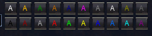

---
tags:
  - command
---

# /hotbutton

## Syntax

<!--cmd-syntax-start-->
```eqcommand
/hotbutton <name> [<color>] [<text>]
```
<!--cmd-syntax-end-->

## Description

<!--cmd-desc-start-->
Create or edit a hotbutton named `<name>`, optionally change the color <0-19> and/or the body `<text>`.
<!--cmd-desc-end-->

## Options

**name**
:   The name of the hotbutton

**color**
:   Any number from 0 to 19.<br>

**text**
:   The text to include in the hotbutton

!!! example
    `/hotbutton PULL 14 /g %t incoming!`
    :  Create a hotbutton named "PULL", bright green, that contains the text: */g %t incoming!*

## See also

- [/pause](cmd-pause.md)
