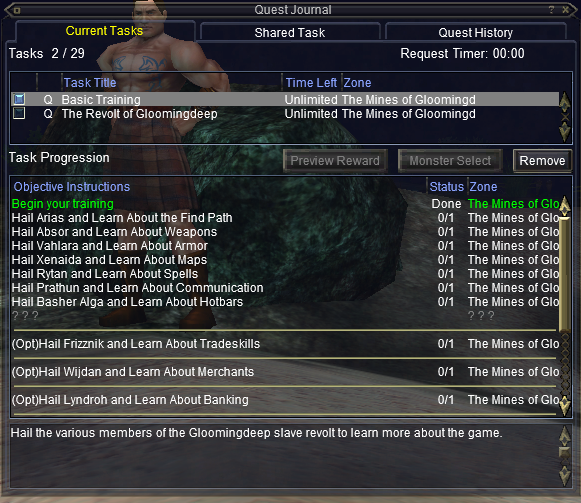
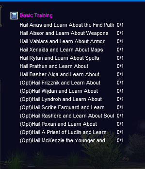

---
tags:
  - command
---

# /taskoverlay

## Syntax

<!--cmd-syntax-start-->
```eqcommand
/taskoverlay
```
<!--cmd-syntax-end-->

## Description

<!--cmd-desc-start-->
Toggles the "Task Overlay" window, which gives a summary of quests and your progress.
<!--cmd-desc-end-->

## Examples

A starting character in The Mines of Gloomingdeep (Tutorial) will see the The following Current Tasks in their Quest Journal,



and their Task Overlay window will display as;


