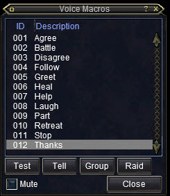

---
tags:
  - command
---

# /vgroup

## Syntax

<!--cmd-syntax-start-->
```eqcommand
/vgroup <1-12>
```
<!--cmd-syntax-end-->

## Description

<!--cmd-desc-start-->
Play a voice macro for your group, with accompanying text.
<!--cmd-desc-end-->

## Options

**`<1-12>`**
:   Play a voice macro, number 1 through 12.  
    

## Examples

!!! example "`/vg 2` - Will play the 'Attack!' voice macro to your group."

## See also

- [/vplay](cmd-vplay.md)
- [/vraid](cmd-vraid.md)
- [/vtell](cmd-vtell.md)
